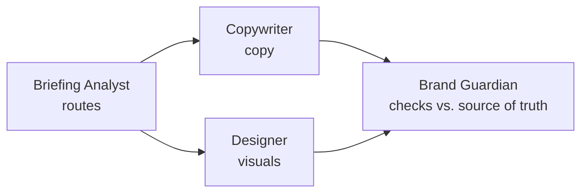

# PowerDigital Lab

PowerDigital Lab is a small team of AI agents that produces on-brand creative for Power Digital's client brands — Meta/Instagram posts, Google Ads programmatic banners, and email marketing creative.

It exists to take the repetitive, manual side of design production off the team's plate: resizing the same creative across a dozen ad sizes, adapting copy across message variants, recoloring templates across a brand's palette. None of that needs creative judgment, it just takes time. Automating it frees up time for the work that actually needs a person — strategy, art direction, reviewing the output — while a dedicated brand agent and a human review step keep everything on-brand before it ships.

---

## Technical reference

The rest of this document is for whoever maintains the setup.

### The agent team

Defined in [.claude/agents/](.claude/agents/) — a small, fixed team of 4, scoped to *making the creative*. Media buying and conversion tracking are out of scope on purpose — a different team's job once a brand is live.

- **Briefing Analyst** (`briefing-analyst.md`) — receives the demand, identifies the brand and the ask, hands off to the right specialist.
- **Brand Guardian** (`design-brand-guardian.md`) — holds the full brand, checks everything before it ships.
- **Copywriter** (`copywriter.md`) — copy for Meta creatives and banner ads, plus testing angles. Sits out brands whose copy arrives pre-approved (e.g. Tom's of Maine).
- **Designer** (`designer.md`) — visual direction for Meta creatives, AI image-prompt generation for banners, and email creative layout.

Copywriter and Designer are brand-agnostic in structure but brand-aware in content: each carries a `## <Brand>` section, right inside its own file, for every onboarded client. Briefing Analyst hands off by naming the brand, it doesn't re-explain it.

### How an agent works (cheat sheet)

An agent = one markdown file in `.claude/agents/`: YAML frontmatter + a system prompt. No code, no build step.

| Frontmatter field | Does |
|---|---|
| `name` / `description` | Routes the request here. Vague description = broken routing |
| `tools` | Limits what it can touch (omit = full access) |
| *(body text)* | The actual instructions |

**Two styles in this repo:**

| | Template-heavy | Fact-heavy |
|---|---|---|
| Example | `design-brand-guardian.md` | `copywriter.md`, `designer.md`, `briefing-analyst.md` |
| Origin | Near-verbatim from [agency-agents](https://github.com/msitarzewski/agency-agents) | Written for this repo |
| Holds | Persona, rules, output templates | Real hex codes, approved lines, do/don't per brand |
| Why it works | Reads `clients/<brand>/01-brand/identity/` live, no facts baked in | Real facts beat generic advice once you have them |

**The flow:**



Fixed at 4 agents on purpose: a new brand or format means teaching the existing agents, not adding a 5th.

### Building a new agent: checklist

- [ ] `name` + `description` that says **when** to call it
- [ ] `tools` scoped to what it actually needs
- [ ] Role in one sentence
- [ ] Scope: what it does / does not do
- [ ] Real, verified facts, not generic advice
- [ ] Short do/don't rules
- [ ] "Don't guess, flag a human" rule
- [ ] Handoff: who gets the output next

<details>
<summary>Minimal skeleton</summary>

```markdown
---
name: AgentName
description: When to call this agent
tools: Read, Write, Edit
---
# AgentName
[Role in one line]

## Scope
Does / does not (→ who does)

## Facts
- ...

## Missing info
Flag it, don't guess.

## Handoff
→ next agent
```
</details>

### How branding flows into the agents

- **Brand Guardian owns the full guidelines** — distilled into one digest at `clients/<brand>/01-brand/identity/brand-guidelines.md`. For tokens and basic elements (color, type, logo), the shared [Figma Library](https://www.figma.com/design/pcf9QNPjvBBzqDPnBLefVS/Claude-Design-Ops---Lab?node-id=74-7766) — one style-guide section per brand — outranks the PDF and this digest wherever they disagree.
- **The same Figma Library also holds reusable design templates per brand**, not just tokens — Katapult's live under [node 251:480](https://www.figma.com/design/pcf9QNPjvBBzqDPnBLefVS/Claude-Design-Ops---Lab?node-id=251-480) ("/templates - Katapult"), 11 branded layout patterns, on-brand with real approved copy already in place. Designer starts here before building a new layout from scratch. (An older node, `178:1377`, was cited here previously — confirmed gone as of 2026-09-10, don't use it.)
- **Copywriter and Designer get only their slice**, written directly into their own `## <Brand>` section — voice and approved phrasing for Copywriter, palette and photography rules for Designer.
- **References** (templates, layout specs) live alongside the digest, under `01-brand/references/`.
- **Every human correction becomes a standing rule**, written back into the relevant brand section.

Katapult's sections are fully written from its brand guidelines. Roku's are partial — visual facts observed while reframing existing creative, with voice and audience flagged as not yet captured rather than guessed at.

### Repository structure

```
.claude/agents/               the fixed 4-agent team (auto-loaded by Claude Code)
clients/
  <brand>/
    01-brand/
      identity/
        brand-guidelines.md  master digest (Brand Guardian's source of truth)
      references/            templates, layout specs, test imagery
    00-inbox/                incoming demands
    04-deliverables/
      social/                Meta creatives produced
      banners/               banner creatives produced
      email/                 email creatives produced (batch-based brands, e.g. Tom's of Maine)
```

### Learning loop — examples already captured for Katapult

- The product mockup bleeds off a frame edge and sits high to fill the space, never floating.
- Headlines run large and are scaled to the format, never timid.
- The legal disclaimer is white with a thin black outline so it stays legible over a photo, and is dropped on the smallest units.
- Color variations are produced by recoloring a single template across the brand palette.
- Reframing to a new aspect ratio (4:5/16:9/9:16) needs per-ratio composition judgment, not a uniform scale-down — see `designer.md`'s Figma-execution discipline notes for the safe-zone and balance rules a real reframe test (2026-09-10) surfaced.
- A Figma `.clone()` can silently reparent to the wrong container — always verify a new node's actual parent, and verify success by screenshotting the container it should appear in, not just the node itself.
